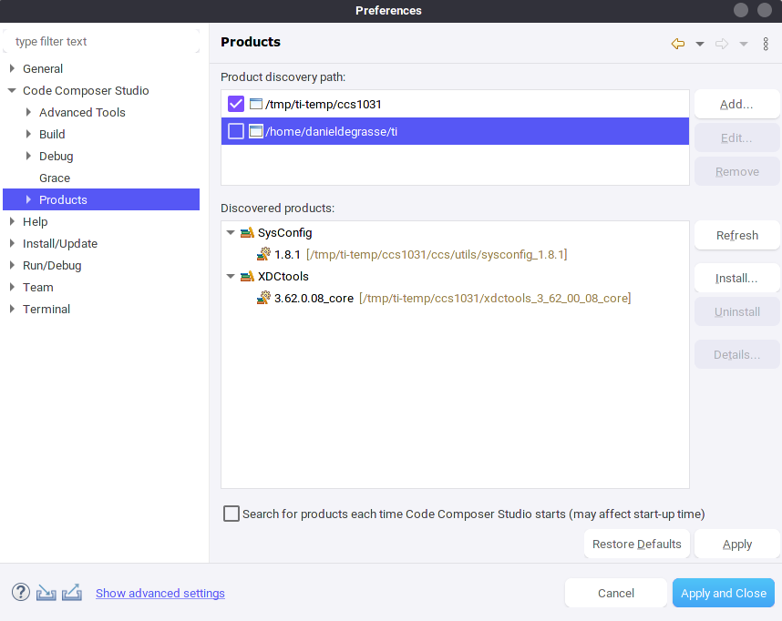
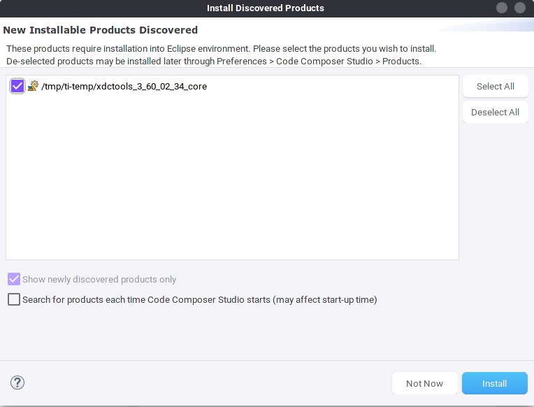
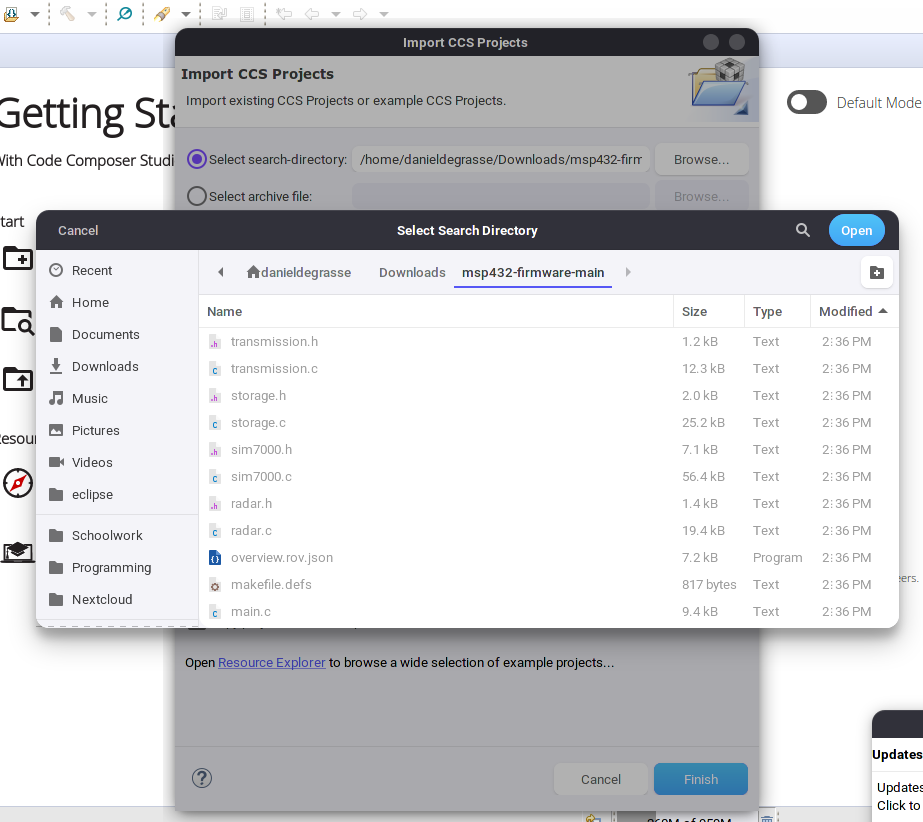
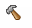
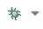

# Guide to Building and Flashing Firmware
This guide is intended to get you up and running without any of the required tools for flashing the MSP432 firmware installed.
## Step 0: Acquire Hardware
You need a FloodtherBoard v2.0 (the custom board designed for this project), and an MSP432 Evaluation debugger board to flash and test this firmware

## Step 1: Install Required Software
For this step, first download the following software:
- [Code Composer (on demand installer)](https://www.ti.com/tool/CCSTUDIO)
- [SIMPLELINK-MSP432-SDK](https://www.ti.com/tool/SIMPLELINK-MSP432-SDK) (not the SIMPLELINK-MSP432E4-SDK)

Now, we will install code composer. Launch the downloaded installer, and click forwards (accepting the defaults) until you reach the **Setup Type** screen. Select **Custom Installation**.

Now, select the following components:
- SimpleLink MSP432 low power + performance MCUs
- **OPTIONAL**: mmWave Sensors (only needed if you'd like to develop for the radar board)

Accept the rest of the defaults on the next few screens, and wait for Code Composer to install.

Now that Code Composer is installed, install the MSP432 SDK. Launch the installer, and ensure the installation directory is the same `ti` directory that Code Composer installed to. Now, click through the installer and allow it to install the SDK.

Now, open Code Composer (the default workspace is fine), and click on 'Window->Preferences' within the menu bar. Within the window that opens, go to the 'Code Composer Studio' dropdown, and select the 'Products' option. You should see a window like the following:

\image latex media/CCStudio-Products.png "Code Composer Products Window" width=10cm

\image html media/CCStudio-Products.png 

Ensure that the `ti` directory that Code Composer is installed into is listed (and selected) in product discovery paths (if not, use the 'Add' button to add it), and then click the 'Refresh' button. You should see a popup like the following:

\image latex media/CCStudio-Installable.png "Code Composer New Products Popup" width=10cm

\image html media/CCStudio-Installable.png 

Click install. Code Composer will request that you restart it. Once it restarts, reopen the products window and verify that you now see 'SimpleLink MSP432P4 SDK' in the Discovered Products list. If not, verify it is installed within your product discovery path and try the above steps again.

At this point, you have all tools required to build and flash code onto the MSP432.

## Step 2: Import and Build the Project
Download the project (`git clone`, any other git client, or simply downloading the project as a zip and extracting it should be fine)

[Here's a link to the project github](https://github.com/floodofelecs/msp432-firmware). If you can't access this (it's a private repo) you will need to be added to the repository or log in as the flood of elecs email account (that account owns the repository)

Once you have the project downloaded, return to Code Composer and select 'Project->Import CCS Projects' from the menu bar. Set the search directory to the folder that was created when you extracted or cloned the repository. You should see something like this:

\image latex media/CCStudio-Project-Import.png "Code Composer Project Import" width=10cm

\image html media/CCStudio-Project-Import.png

You should now see 'flood-msp432-firmware' in the list of discovered projects. Select the 'Copy projects into workspace' option, and then click 'Finish'.

At this point, you should be ready to build the project. Press the 'Build' icon in the toolbar: , and wait for the project to build.

Once the project builds, you can proceed to flashing the target board.

## Step 3: Connecting the Target Board to Debugger
To flash the firmware, you must ensure that the `TDI`, `TDO`, `TCK`, `TMS`, and `RST` pins are connected to the target board, which must also have its `+3v3` line powered. `RXD` and `TXD` can be connected to the UART `UCA0RX` and `UCA0TX` breakout pins if the serial cli is desired. (In this case, the debugger should also have a shared ground connected to the target board).

**NOTE: the pins *closer* to the Micro USB port with these labels on the MSP432 Evaluation board should be used. The other pins connect to the MSP432 that is on the evaluation board.**
 
Here is a table of all required connections:
| Debugger Pin | Target Board Pin |
| ----         | ----             |
| RST          | RST              |
| TMS          | TMS              |
| TCK          | CLK              |
| TDO          | TDO              |
| TDI          | TDI              |

The following connections are required to use UART:
| Debugger Pin | Target Board Pin |
| ----         | ----             |
| TXD          | UCA0TX           |
| RXD          | UCA0RX           |
| GND          | Any Ground on the board |

## Step 4: Flashing the Firmware
Now, connect the target board to power (you should see the green LED turn on), and connect the MSP432 debugger to your computer via USB. Make sure the MSP432 target board does not have an SD card inserted (just for this test, this is not required for flashing). Now, press the debug icon in code composer: . You should see a debugging view come up in Code Composer. If everything worked, you should see the play button illuminate and be able to press it. (This one is greyed out): 

Once the 'play' button is pressed, the code should be running. You should start to see logs in the console window, and output on the UART command line if you connected it. The red light on the development board should blink

Congratulations, you have flashed the Flood of Elecs MSP432 firmware!

## Tools to view the UART Command Line
On Windows, Putty will work. On Linux, use Minicom. You'll need to set to baud rate to 115200, and everything else can be left as default (although you need to know your COM port number or device name).